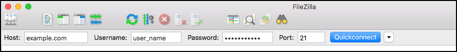
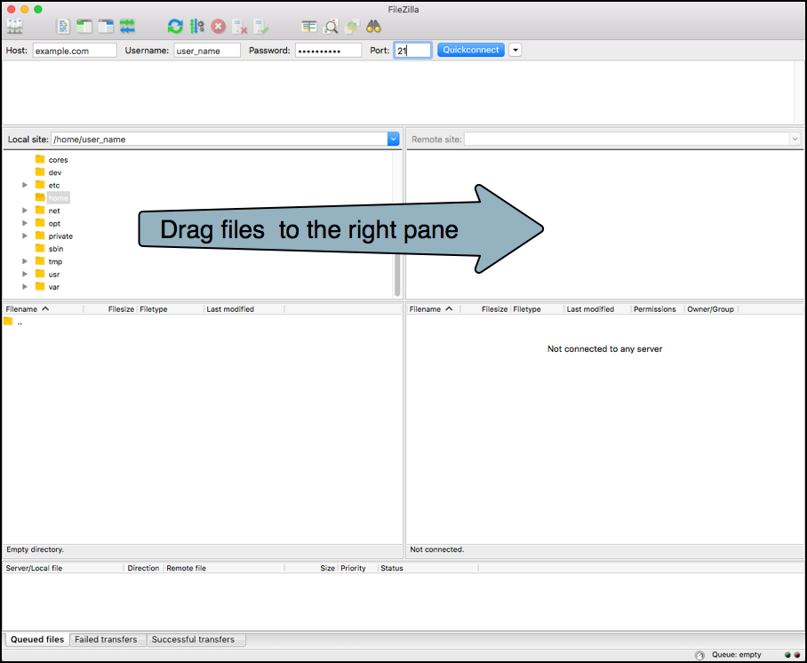
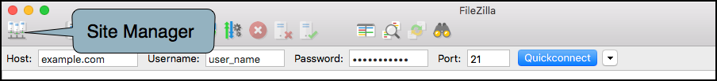
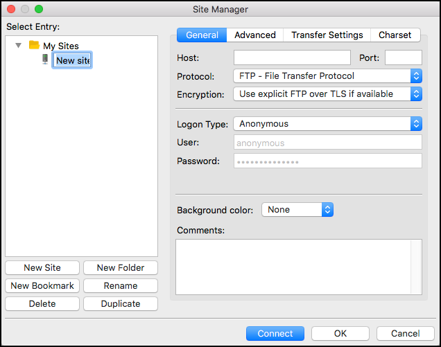

# Uploading files to your website using FTP or SFTP 

### Overview 

This user guide will explain how to connect to your website and upload files using FTP or SFTP. 

**NOTE** - if you have large files to upload (5 MB or greater), check with Technical Support to make sure that there are no file size limitations in place. 

### Prerequisites 

Before uploading files to your website using either FTP or SFTP, you will need the following: 

For FTP:  

* The hostname for your website or Virtual Server (this can be a domain name or IP address)
* Your FTP user name and password 
* FTP port number (usually port 21)
* An FTP client (see below)

For SFTP: 

* The hostname for your website or Virtual Server (this can be a domain name or IP address)
* Your SFTP user name and password (this may be different than the FTP user and password)
* SFTP port number (usually port 22)
* An SFTP client (see below)

If you do not know your FTP/SFTP user and password, contact Technical Support. In order to use SFTP (a more secure option) you may need to have some configuration changes made to your account. 

**FTP/SFTP clients** - there are a large number of FTP/SFTP clients available, both free and for purchase. For this user guide, [**FileZilla**](https://filezilla-project.org/index.php "FileZilla") is used for all examples. FileZilla is free and open source, available for Windows, Mac OS X, and Linux, and can be used as an FTP or an SFTP client. 

[FTP and SFTP client configuration using FileZilla](#ftp-and-sftp-client-configuration-using-filezilla)  
[Using the Quickconnect bar](#using-the-quickconnect-bar)  
[Using the Site Manager](#using-the-site-manager)  

[Additional Information](#additional-information)  

---

## FTP and SFTP client configuration using FileZilla 

### Using the Quickconnect bar

When you open FileZilla you should see the **Quickconnect** bar at the top of the application. The Quickconnect bar allows you to quickly enter in the login information for your website so you can upload files. 

* **Host** - this is the domain name or IP address of your website (or Virtual Server)
* **Username** - your FTP or SFTP username (this is case sensitive)
* **Password** - your FTP or SFTP password 
* **Port** - this will generally be 21 for FTP or 22 for SFTP (check with your system administrator if unsure)

After you have entered in the correct information, click on **Quickconnect** - this will connect you via FTP or SFTP to your website. 

Once you have connected, you can drag and drop files from the **Local site** (the left pane) to the **Remote site** (the right pane).

 

### Using the Site Manager 

If you are going to connect to the same website via FTP/SFTP on a regular basis, or you will be managing several FTP or SFTP logins, you can add each login to the **Site Manager**. This will allow you to save all the login information for each website instead of having to re-enter it every time. 

To access the **Site Manager**, click on the Site Manager link at the top left of the FileZilla application, just above the Quickconnect bar. 

 
This opens the **Site Manager** configuration screen, on the **General** configuration tab.   

* **Host** - this is the domain name or IP address of your website (or Virtual Server)
* **Port** - this will generally be 21 for FTP or 22 for SFTP (check with your system administrator if unsure)
* **Protocol** - select **FTP** or **SFTP** from the drop down menu 
* **Encryption** - only available for FTP, leave at the default unless you have a specific reason to change it  
 

* **Logon Type** - if you are the only person using this computer, select **Normal**, otherwise select **Ask for password**
* **User** - your FTP or SFTP username
* **Password** - your FTP or SFTP password 

Once you have entered in the information, click **OK** to save. To give the new site a name, click on **New Site** under **My Sites**, and then click on **Rename**. 

---

## Additional Information 

For more information on how to use and configure FileZilla, see the official [FileZilla Client Tutoria](https://wiki.filezilla-project.org/FileZilla_Client_Tutorial_(en) "FileZilla Client Tutorial") and the [FileZilla Documentation](https://wiki.filezilla-project.org/Documentation "FileZilla Documentation"). 

